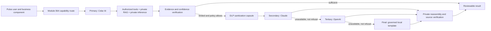

# PR #418 Extension — Celar AI and Module 064 Unified Routing

Repository: `ahmedadeyemi-cts/project-time-platform`  
Target pull request: **#418 — Module 011: Add the Celar AI enterprise platform interface**  
Target branch: `feature/celar-ai-enterprise-platform-interface-20260801`

## 1. Architecture decision

Module 064 must be the single AI control plane for Pulse. Celar AI belongs on this page as the **private orchestration target**, but it must not be represented as a public vendor provider or as another public API-key form.

The page should distinguish:

1. **AI execution targets**
   - Celar AI — private orchestration, governed tools, private RAG, private inference, evidence verification.
   - Claude — optional external reasoning through sanitized policy only.
   - OpenAI — optional external reasoning through sanitized policy only.
   - Governed local template — deterministic final fallback.

2. **Capability routes**
   - Ordered execution policy for each business capability.
   - Primary, secondary, tertiary, and final fallback.
   - Default: `Celar AI → Claude → OpenAI → Governed local template`.

3. **Private runtime profile**
   - Private endpoint and model metadata.
   - Write-only private bearer token or secret reference.
   - Private-host allowlist.
   - Readiness test and sanitized diagnostics.

## 2. Required capability catalog

Use separate capability codes so the privacy and evidence rules are explicit:

| Capability code | Display name | Owning modules | Default route | External-context rule |
|---|---|---|---|---|
| `timesheet_non_project_description` | Timesheet — Non-project time | 001 | Celar → Claude → OpenAI → Local | Only user-entered note, category, date, and non-project row metadata may leave the private boundary after sanitization. |
| `timesheet_project_task_description` | Timesheet — Project tasks | 001, 019 | Celar → Claude → OpenAI → Local | Raw project documents and restricted records stay private. External stages receive generic sanitized assistance only. |
| `timesheet_service_request_description` | Timesheet — Requests / Service Requests | 001 plus request owner | Celar → Claude → OpenAI → Local | Request records, attachments, IQS, SOW, GSD, and email evidence stay private. External stages receive generic sanitized assistance only. |
| `sow_gsd_planning` | SOW / GSD planning | 011, 025 | Celar → Claude → OpenAI → Local | Customer, commercial, design, contract, pricing, and document evidence stays private. |
| `project_flowhive_plan` | Project FlowHive plan, schedule, and diagram | 011, 066 | Celar → Claude → OpenAI → Local | Project plan evidence stays private; external stages provide generic planning patterns only. |
| `closeout_communication` | Closeout communication | Closeout owner, 011 | Celar → Claude → OpenAI → Local | Project facts and acceptance evidence stay private; external stages may assist only with generic structure/tone. |
| `help_assistant` | Celar AI system help | 011, 999 | Celar → Claude → OpenAI → Local | Governed tools and source-controlled product knowledge first; public fallback receives no private operational records. |

Retain `timesheet_description` as a compatibility alias that resolves to the correct specific capability based on row type and request/task context.

## 3. Route editor behavior

Each capability card in Module 064 must support:

- **Primary** target.
- **Secondary** target.
- **Tertiary** target.
- **Final fallback** target.
- Save, cancel, and reset-to-default controls.
- Unsaved-change warning.
- Last changed by / last changed at metadata.
- Audit history link.
- “Where this route is used” module badges.
- Context-policy labels: `Private`, `Sanitized external only`, or `Deterministic`.

Validation rules:

- Targets must be unique within a route.
- Governed local template must remain present.
- Default and recommended position for local template is final.
- A provider safety refusal terminates the route; the next target is not attempted.
- Disabled, unconfigured, unhealthy, or circuit-open targets are skipped.
- Restricted/private context is never sent directly to Claude or OpenAI regardless of route order.
- A route change must not alter business records, submit time, publish a SOW, baseline a plan, send a closeout email, or deploy software.

## 4. Central routing contract

Introduce a central capability router that owns all AI execution decisions.

```csharp
public static class CelarAiTargets
{
    public const string Celar = "celar_ai";
    public const string Claude = "claude";
    public const string OpenAi = "openai";
    public const string Local = "local_template";
}

public sealed record CelarAiCapabilityRoute(
    string Feature,
    IReadOnlyList<string> Targets,
    string ExternalContextPolicy,
    IReadOnlyList<string> ConsumerModules,
    DateTimeOffset UpdatedAt,
    Guid? UpdatedBy);

public sealed record CelarAiExecutionContext(
    string Feature,
    bool ContainsPrivateDocuments,
    bool ContainsCustomerIdentity,
    bool ContainsPeopleRecords,
    bool ContainsFinancialValues,
    bool AllowSanitizedExternalAssistance,
    IReadOnlyList<string> SensitiveTerms);
```

Execution behavior:

1. Resolve the current persisted route from Module 064.
2. Attempt Celar AI private tools/RAG/inference when selected.
3. Evaluate evidence coverage and confidence.
4. Before Claude/OpenAI, create a DLP capsule and fail closed if sanitization is incomplete.
5. Call public providers only through the existing Module 064 adapters and health/circuit-breaker controls.
6. Reassemble generic assistance with private evidence inside Pulse.
7. Use the governed local template when no earlier target produces an authorized result.
8. Return route evidence: selected target, attempted targets, skipped targets, policy decisions, confidence, citations, and correlation ID.

The external-reasoning service must start at the external portion of the route or explicitly skip `celar_ai`; this prevents recursive Celar-to-Celar routing.

## 5. Persistence and audit

Add versioned schema rather than relying only on process environment variables.

Recommended tables:

```sql
CREATE TABLE ai_capability_routes (
    feature_code TEXT PRIMARY KEY,
    route_targets JSONB NOT NULL,
    external_context_policy TEXT NOT NULL,
    revision INTEGER NOT NULL DEFAULT 1,
    updated_at TIMESTAMPTZ NOT NULL DEFAULT CURRENT_TIMESTAMP,
    updated_by UUID
);

CREATE TABLE ai_capability_route_audit (
    audit_id BIGINT GENERATED ALWAYS AS IDENTITY PRIMARY KEY,
    feature_code TEXT NOT NULL,
    previous_targets JSONB,
    new_targets JSONB NOT NULL,
    previous_external_context_policy TEXT,
    new_external_context_policy TEXT NOT NULL,
    actor_user_id UUID,
    occurred_at TIMESTAMPTZ NOT NULL DEFAULT CURRENT_TIMESTAMP
);

CREATE TABLE ai_private_model_profiles (
    environment_code TEXT PRIMARY KEY,
    enabled BOOLEAN NOT NULL DEFAULT FALSE,
    endpoint_ciphertext BYTEA,
    endpoint_nonce BYTEA,
    endpoint_tag BYTEA,
    endpoint_host_fingerprint TEXT,
    model_name TEXT NOT NULL DEFAULT '',
    auth_mode TEXT NOT NULL DEFAULT 'bearer',
    token_ciphertext BYTEA,
    token_nonce BYTEA,
    token_tag BYTEA,
    token_fingerprint TEXT,
    private_host_allowlist JSONB NOT NULL DEFAULT '[]'::jsonb,
    require_private_model_for_documents BOOLEAN NOT NULL DEFAULT TRUE,
    revision INTEGER NOT NULL DEFAULT 1,
    updated_at TIMESTAMPTZ NOT NULL DEFAULT CURRENT_TIMESTAMP,
    updated_by UUID
);

CREATE TABLE ai_private_model_profile_audit (
    audit_id BIGINT GENERATED ALWAYS AS IDENTITY PRIMARY KEY,
    environment_code TEXT NOT NULL,
    action TEXT NOT NULL,
    revision INTEGER NOT NULL,
    actor_user_id UUID,
    occurred_at TIMESTAMPTZ NOT NULL DEFAULT CURRENT_TIMESTAMP
);
```

Security requirements:

- Encrypt endpoint and token values with the existing Module 064 32-byte AES-GCM key boundary or an approved Key Vault-backed adapter.
- Never return endpoint, token, API key, ciphertext, nonce, or tag.
- Return only configured flags, host fingerprint, model name, allowlist count, token fingerprint, revision, and timestamps.
- Use actual-session administrator authority; View-As can never mutate.
- Require same-origin requests and optimistic revision checks.
- Audit every route/profile change without secret values.

## 6. Module 064 API additions

```text
GET  /api/ai-configuration/routes
PUT  /api/ai-configuration/routes/{featureCode}
POST /api/ai-configuration/routes/{featureCode}/reset
GET  /api/ai-configuration/consumers

GET  /api/ai-configuration/private-model
PUT  /api/ai-configuration/private-model/settings
PUT  /api/ai-configuration/private-model/secret
POST /api/ai-configuration/private-model/test
```

Private model test response must be sanitized:

```json
{
  "status": "private_model_available",
  "configured": true,
  "endpointReturned": false,
  "tokenReturned": false,
  "model": "configured-model-name",
  "latencyMilliseconds": 123,
  "diagnosticCode": "generation_verified",
  "testedAt": "..."
}
```

## 7. Private model configuration

The existing runtime expects an OpenAI-compatible private inference endpoint. Until the Module 064 profile editor is added, configuration is environment-based:

```text
PROJECTPULSE_PULSE_AI_PRIVATE_RAG_ENABLED=true
PROJECTPULSE_PRIVATE_INFERENCE_ENDPOINT=https://<private-host>/<inference-path>
PROJECTPULSE_PRIVATE_INFERENCE_MODEL=<private-model-or-deployment-name>
PROJECTPULSE_PRIVATE_INFERENCE_BEARER_TOKEN=<write-only secret when required>
PROJECTPULSE_PRIVATE_ENDPOINT_HOST_ALLOWLIST=<approved private host or DNS suffix>
```

For complete document ingestion and private RAG, also configure:

```text
PROJECTPULSE_PULSE_AI_PRIVATE_RUNTIME_WORKER_ENABLED=true
PROJECTPULSE_PULSE_AI_DOCUMENT_MALWARE_SCANNER_MODE=<clamav_tcp|pre_scanned_attestation>
PROJECTPULSE_PULSE_AI_CLAMAV_HOST=<private scanner host, when used>
PROJECTPULSE_PRIVATE_OCR_ENDPOINT=<private OCR endpoint>
PROJECTPULSE_PRIVATE_OCR_MODEL=<OCR model>
PROJECTPULSE_PRIVATE_OCR_BEARER_TOKEN=<secret when required>
PROJECTPULSE_PRIVATE_EMBEDDING_ENDPOINT=<private embedding endpoint>
PROJECTPULSE_PRIVATE_EMBEDDING_MODEL=<embedding model>
PROJECTPULSE_PRIVATE_EMBEDDING_BEARER_TOKEN=<secret when required>
```

Migrations 052, 053, and 054 and their runtime readiness checks must be active in the target environment before the complete document-grounded path is considered ready.

## 8. Consumer wiring

### Timesheet — non-project

- Route through `timesheet_non_project_description`.
- Celar AI first uses deterministic enterprise wording and, when configured, the private model.
- Inputs are limited to work date, category, row label, user note, and allowed role context.
- No project/customer documents are assumed.
- Generated text is review-only and never saves or submits time automatically.

### Timesheet — project task

- Route through `timesheet_project_task_description`.
- Resolve authorized project/task records.
- Retrieve eligible SOW, GSD, IQS, architecture, design, order, quote, supporting, and approved email-derived evidence.
- Preserve citations and source versions.
- Public providers receive no raw project evidence.

### Timesheet — request / service request

- Route through `timesheet_service_request_description`.
- Add request-specific evidence adapters for request metadata, attachments, IQS, related project documents, and governed email artifacts.
- Enforce request/project authorization independently of the UI.
- Distinguish request number/function/status from project task details.

### Project FlowHive

- Replace the current “AI execution locked” experience with a review-only Module 064/Celar generation endpoint.
- Generate WBS, dependencies, roles, assumptions, risks, milestones, high-level timeline, and diagram.
- Send the draft to the deterministic Module 066 schedule engine before any baseline proposal.
- Do not persist, assign resources, commit customer dates, or baseline automatically.

### SOW / GSD planning

- Route existing Module 025/011 generation through `sow_gsd_planning`.
- Private evidence first.
- Keep commercial, legal, security, technical, and customer approval gates.
- Never publish or overwrite an approved SOW automatically.

### Closeout communication

- Add an implemented consumer, not only a feature-route card.
- Ground the draft in authorized completion status, acceptance evidence, deliverables, unresolved items, risks, handoff records, and approved recipients.
- Generate internal-review and customer-ready variants.
- Never send email automatically; hand off to the owning notification/mail module only after explicit review and approval.

## 9. Consumer assurance registry

Add a source-controlled registry containing every AI consumer:

```json
[
  { "feature": "timesheet_non_project_description", "module": "001", "entryPoint": "ProjectPulseAiTimeEntrySuggestionService" },
  { "feature": "timesheet_project_task_description", "module": "001", "entryPoint": "ProjectPulseAiTimeEntrySuggestionService" },
  { "feature": "timesheet_service_request_description", "module": "001", "entryPoint": "ProjectPulseAiTimeEntrySuggestionService" },
  { "feature": "sow_gsd_planning", "module": "025", "entryPoint": "CelarAiEnterprisePlatformService" },
  { "feature": "project_flowhive_plan", "module": "066", "entryPoint": "CelarAiEnterprisePlatformService" },
  { "feature": "closeout_communication", "module": "closeout-owner", "entryPoint": "CelarAiEnterprisePlatformService" },
  { "feature": "help_assistant", "module": "011", "entryPoint": "CelarAiBrandModule" }
]
```

Module 064 must display whether each registered consumer is:

- Connected to the central capability router.
- Using the configured feature code.
- Private-context compliant.
- Direct-provider-free.
- Last exercised / last successful / last failed.

## 10. Build and security gates

Add validation that fails when:

- A known AI consumer constructs a direct Claude/OpenAI HTTP client.
- A known AI consumer reads provider API keys.
- A known AI consumer bypasses the central capability router.
- A capability route contains duplicates or omits local fallback.
- A restricted capability permits raw external context.
- A private endpoint is public, unapproved, or not allowlisted.
- A secret or endpoint value appears in an API response.
- A generated artifact claims it was automatically saved, submitted, sent, published, baselined, assigned, committed, or deployed.

## 11. Acceptance tests

1. New environment defaults every capability to Celar → Claude → OpenAI → Local.
2. Administrator changes only FlowHive to Celar → OpenAI → Claude → Local; reload preserves the route.
3. View-As cannot change a route or private model profile.
4. A duplicate target is rejected.
5. Local fallback omission is rejected.
6. Private model profile accepts a private allowlisted endpoint and rejects a public host.
7. Endpoint/token values are absent from all GET responses and logs.
8. Project-task Timesheet generation uses private citations and does not send raw documents externally.
9. Non-project Timesheet generation can use the configured route without requiring project documents.
10. Service-request generation uses request evidence and preserves authorization.
11. FlowHive generation returns a review-only plan, timeline, and diagram, then validates through the deterministic schedule engine.
12. SOW output remains non-binding and unpublished.
13. Closeout output remains unsent until explicit review.
14. Provider refusal stops the route.
15. Provider outage skips to the next healthy target.
16. Module 064 consumer registry shows every named consumer connected and direct-provider-free.

## 12. PR #418 documentation and architecture updates



The page must state that target order is configurable by capability, but privacy policy is not weakened by route order.

## 13. Non-goals

This PR must not:

- Train a private model.
- Deploy a private inference service.
- Expose private endpoint or token values.
- Send raw internal documents to Claude or OpenAI.
- Automatically save or submit Timesheets.
- Publish SOW/GSD content.
- Baseline a FlowHive plan.
- Send closeout communications.
- Change Azure, Entra, production, or provider credentials during source validation.
